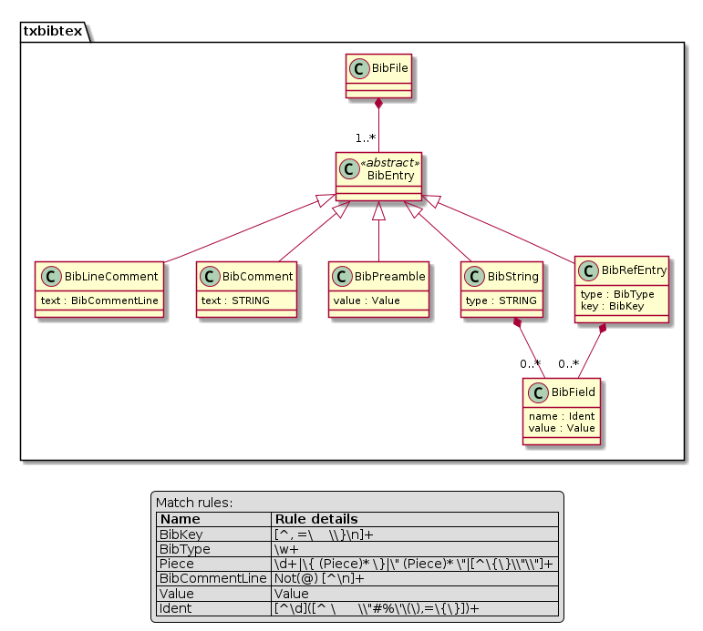

# textx-bibtex

A Python parser for BibTeX language implemented as a textX language.


## What?

- A BibTeX parser for Python implemented as a textX language.
- Easy to use, see bellow.
- Easy to maintain. The whole language implementation is just the language textX
  grammar and some textX registration glue.


## Why?

- Recently I decided to cleanup my BibTeX references and wasn't fully satisfied
  by the parsers available, so I decided to make one in textX. I don't claim
  that this is in any way better than any other, but it did the job for me (see
  examples folder for ideas) in the implementation is very short and easily
  hackable.
- It is fun to make languages in textX!


## Installation

```
pip install textx-bibtex
```

or for `master` branch version:

```
pip install https://github.com/igordejanovic/textx-bibtex/...
```


## Usage


When you install the package you will have textX installed as a dependency. This
gives you the textX command line tool. You can use it to list all textX
available languages:

```
$ textx list-languages
textX (*.tx)                  textX[2.2.0.dev0]                       A meta-language for language definition
bibtex (*.bib)                textx-bibtex[0.1.0.dev0]                The BibTeX language

```

In your script you can instantiate a textX model from your bib file like this:

```python
from textx import metamodel_for_language
mm = metamodel_for_language('bibtex')
bibfile = mm.model_from_file('references.bib')
```

Now, `bibfile` is a Python object (actually object graph) which represents your
bib file. It corresponds to bibtex grammar. The structure of the object graph
(a.k.a. the meta-model) is given in the following image.





This image is produced from the grammar using textX and PlantUML:

```
textx generate txbibtex/txbibtex.tx --target plantuml
plantuml txbibtex/txbibtex.pu
```

You can now process the model like you would any other object model. E.g.
iterate over entries by:

```python
for entry in bibfile.entries:
   ... do something with each bib entry
```

See the examples folder for some ideas. If you make some cool script for bib
references cleanup I would like to see it in the examples folder!


## Final notes

- Initial code for this project was generated by `textx startproject`.
